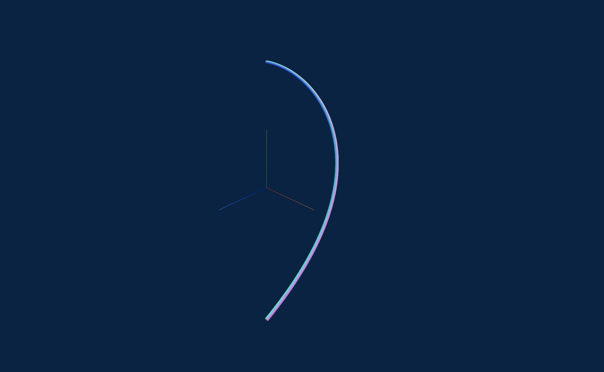
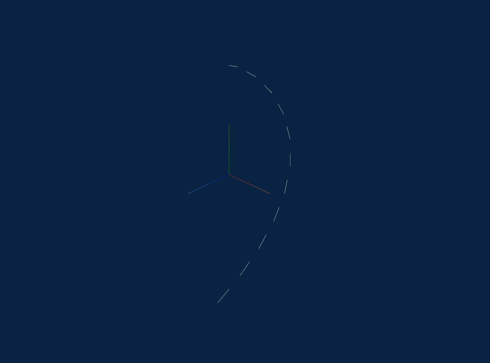
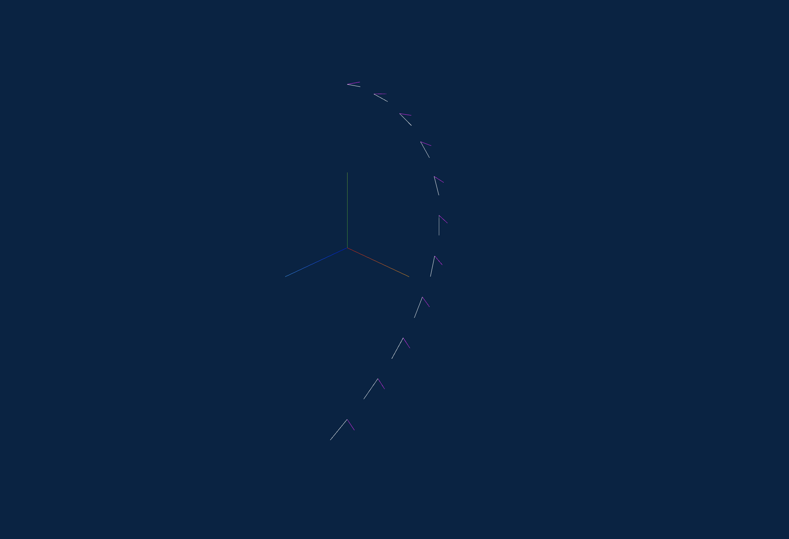
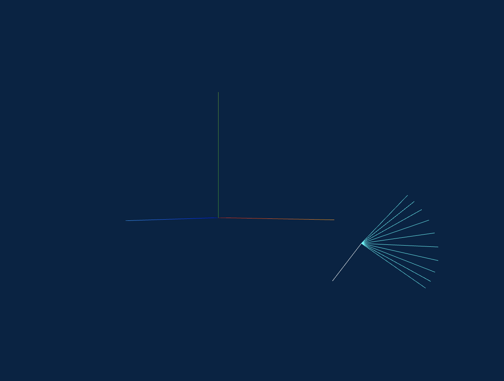
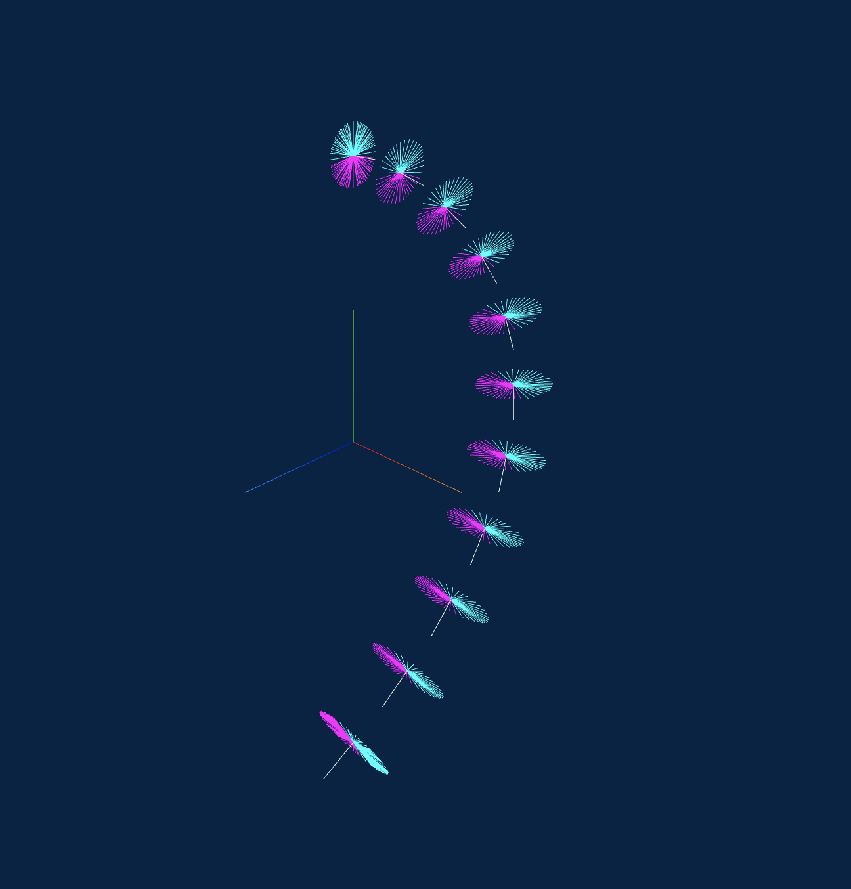

# flexy
A library that bends three.js box geometries along Bezier Curves

# How to install

As an es6 module

```
npm install flexy
```

or from a CDN

```
<script src="http://"></script>
```

# How to use it

```js
import * as flexy from 'flexy';

const R = 3;

const startPoint = new Vector3(R, 0, 0);
const controlPoint1 = new Vector3(R, R * 0.55, 0);
const controlPoint2 = new Vector3(R * 0.45, R, 0);
const endPoint = new Vector3(0, R, 0);

const curve = new CubicBezierCurve3(startPoint, controlPoint1, controlPoint2, endPoint);

flexy.bend({
    THREE, // instance of your app
    curve, // a bezier curve
    quaternion: new THREE.Quaternion().setFromAxisAngle(new THREE.Vector3(), 0), // indicates the global orientation of the curve. for 2D designs you could use that quanternion
    // orientation: new new THREE.Vector3(), instead of the quanternion, directly provide the needed vector
    bufferGeometry: mesh.geometry,
    axis: 'x'
});
```

# Behind the scenes

First, we generate a mesh using the THREE.BoxGeometry constructor.


Then we need a curve that our geometry will be placed & streched/bent upon (in our case the X axis).


First we have to normalize each x coordinate of the box, to a point at our curve. For example, the far left x coordinates, will be normalize to the point at the start of the curve.

Next, we calculate the tangent for of these normalized coordinates.


And we procceed by calculating vectors that are orthogonal/perpendicular to the tangent vectors (the purple lines).


Now all we have to do, is to rotated them (counter)clockwise in order to match the (0, y, z) angle that the current x coordintate has.


Here are the resulting normals.


Finally we need to set the length of each normal, equal to the (0, y, z) length.


in order to get something like this:


Here's another screenshot that emphasizes the relationship between the curve and the box after the box.
