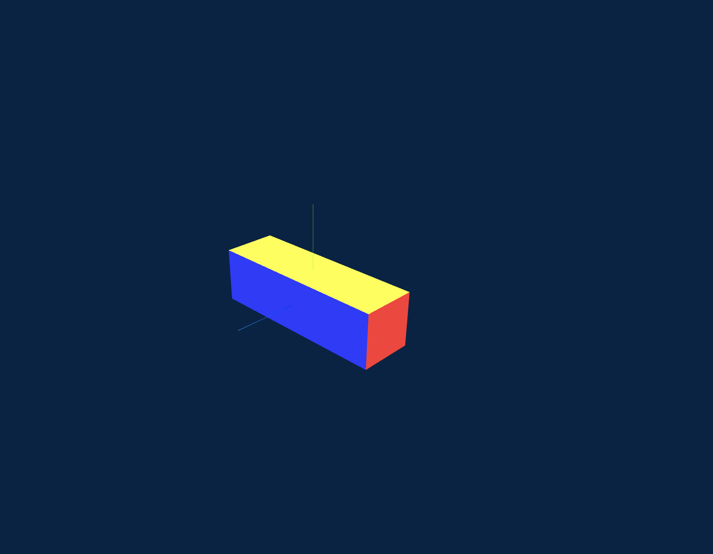
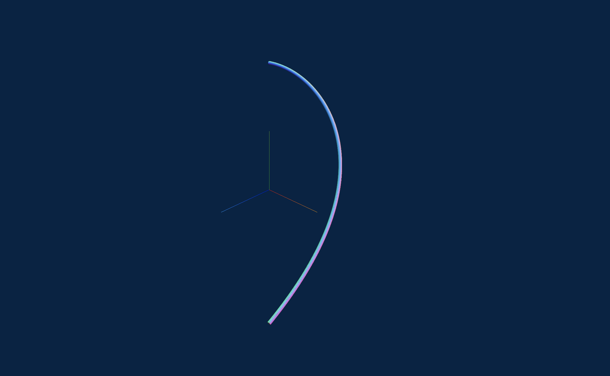
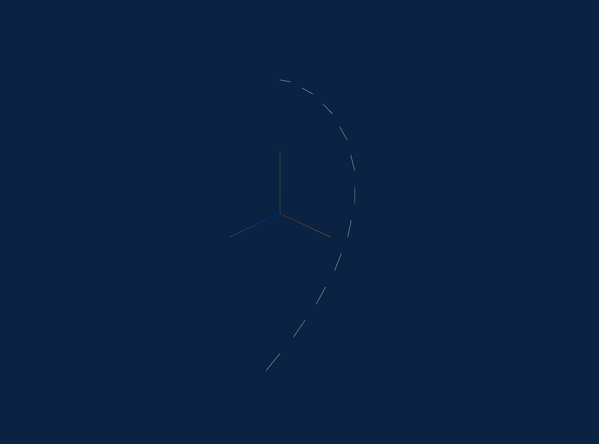
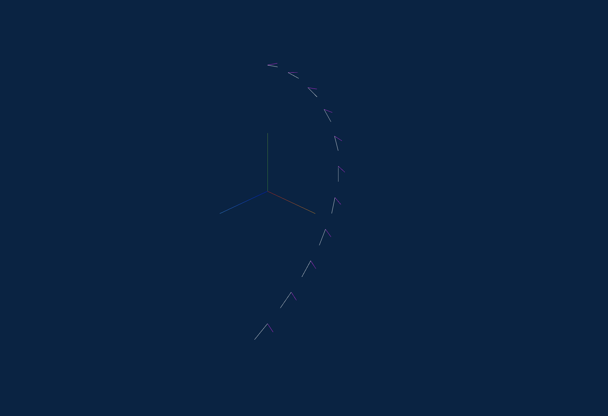
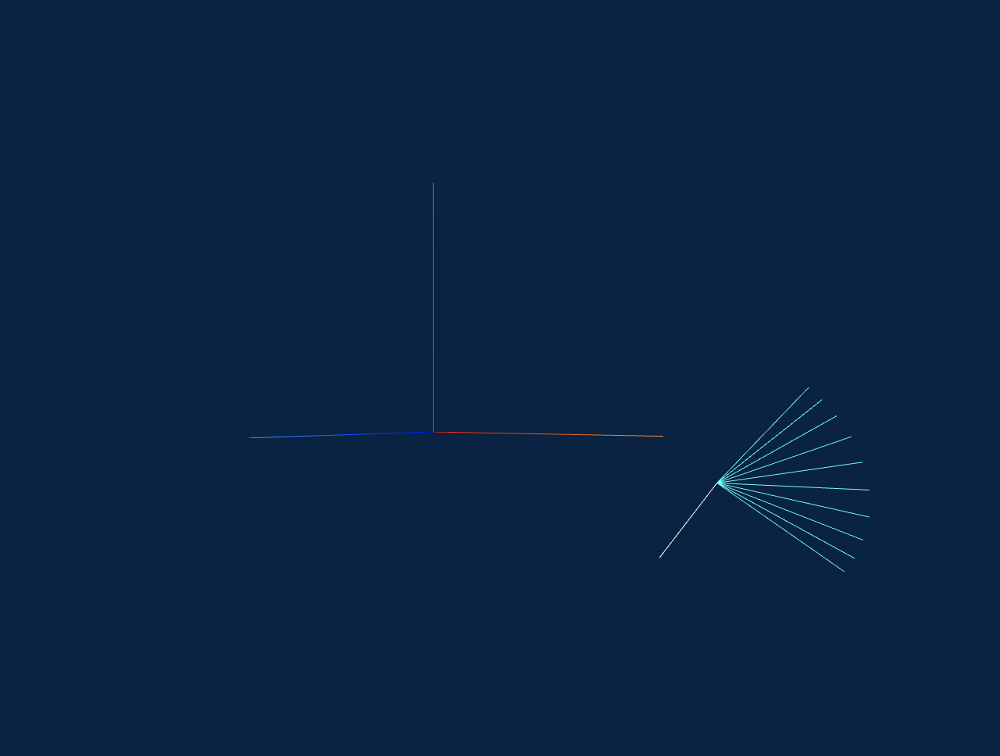
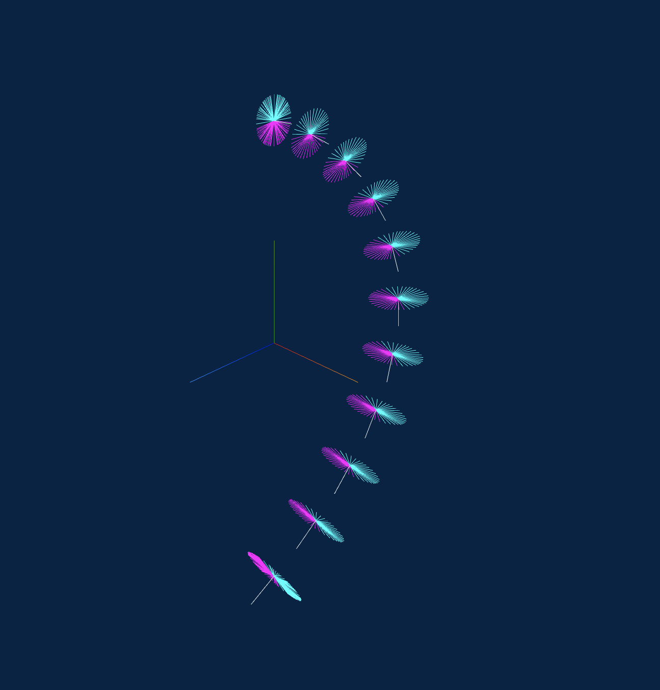

# flexy-bend

A Three.js library that bends `BufferGeometry` along Bezier curves.

## Demo

[Try the interactive demo →](https://ekaratzaferis.github.io/flexy/demo/)

## Install

```
npm install flexy-bend
```

## Usage

```js
import * as flexy from 'flexy-bend';
import * as THREE from 'three';

const R = 3;
const curve = new THREE.CubicBezierCurve3(
    new THREE.Vector3(R, 0, 0),
    new THREE.Vector3(R, R * 0.55, 0),
    new THREE.Vector3(R * 0.45, R, 0),
    new THREE.Vector3(0, R, 0)
);

// A vector perpendicular to the plane the curve lies on.
// For a curve in the XY plane, this is the Z axis.
const orientation = new THREE.Vector3(0, 0, 1);

flexy.bend({
    THREE,
    curve,
    orientation,
    bufferGeometry: mesh.geometry,
    axis: 'x', // the axis the geometry is elongated along
});
```

## API

### `bend(options)`

Bends a `BufferGeometry` along a `CubicBezierCurve3`.

| Option | Type | Required | Description |
|---|---|---|---|
| `THREE` | Library | ✓ | Your THREE.js instance |
| `curve` | `CubicBezierCurve3` | ✓ | The curve to bend along |
| `bufferGeometry` | `BufferGeometry` | ✓ | The geometry to deform |
| `axis` | `'x' \| 'y' \| 'z'` | ✓ | The axis the geometry is elongated along |
| `orientation` | `Vector3` | | A vector perpendicular to the curve's plane |
| `quaternion` | `Quaternion` | | Alternative to `orientation` |
| `mode` | `'fit' \| 'preserve' \| 'tile'` | | Controls how geometry length relates to curve length. Defaults to `'fit'`. See below. |
| `orbit` | `number` | | Fractional shift along the curve. In `'preserve'`: shifts from center (`0.5` toward end, `-0.5` toward start). In `'tile'`: shifts the tiling start position. No effect in `'fit'`. Defaults to `0`. |

#### `mode` values

| Value | Behaviour |
|---|---|
| `'fit'` | The geometry is scaled (stretched or compressed) to exactly fill the full arc length of the curve. |
| `'preserve'` | The geometry keeps its world-space length. It is centered on the curve and shifted by `orbit`. `t` is clamped to `[0, 1]` — the geometry never bends past the curve endpoints. |
| `'tile'` | The geometry keeps its world-space length. When the geometry is longer than the curve, `t` wraps with modulo so the curve pattern repeats across the excess. `orbit` shifts the tiling start position. |

### `getPointToFaceNormalMap(options)`

Raycasts a uniform grid from a rectangular region onto a mesh surface, returning a hashmap from grid points to `{ normal, point }` pairs on the surface. Used as input for `wrap()`.

### `wrap(options)`

Conforms a geometry to a curved surface by looking up the face normal at each vertex's projected position and rotating the vertex to align with it.

### `shear(options)`

Applies a Gaussian shear deformation centered at the midpoint of the geometry. Within each cross-section, vertices are displaced along `shearAxis` in proportion to their distance from the shear-axis center, with a bell-curve falloff from the geometry's center toward its ends.

| Option | Type | Required | Description |
|---|---|---|---|
| `THREE` | Library | ✓ | Your THREE.js instance |
| `bufferGeometry` | `BufferGeometry` | ✓ | The geometry to deform |
| `amplitude` | `number` | ✓ | Maximum displacement at the center cross-section |
| `axis` | `'x' \| 'y' \| 'z'` | | The elongation axis. Defaults to `'x'` |
| `shearAxis` | `'x' \| 'y' \| 'z'` | | The displacement axis (must differ from `axis`). Defaults to `'z'` |
| `sigma` | `number` | | Gaussian spread in world units. Defaults to `geometryLength / 4` |

### `wave(options)`

Applies an arbitrary scalar displacement to a subset of vertices selected by a predicate. The displacement function receives the two coordinates in the plane perpendicular to the displacement axis.

| Option | Type | Required | Description |
|---|---|---|---|
| `THREE` | Library | ✓ | Your THREE.js instance |
| `bufferGeometry` | `BufferGeometry` | ✓ | The geometry to deform |
| `predicate` | `(x, y, z) => boolean` | ✓ | Selects which vertices to affect |
| `fn` | `(u, v) => number` | ✓ | Returns the displacement amount. For `axis='y'`: `fn(x, z)`; `axis='x'`: `fn(y, z)`; `axis='z'`: `fn(x, y)` |
| `axis` | `'x' \| 'y' \| 'z'` | | The displacement axis. Defaults to `'y'` |

---

## How it works

### 1. Start with a box geometry



### 2. Define a curve to bend along



### 3. Normalize each vertex along the bend axis

Each coordinate on the bend axis is mapped to a parameter `t ∈ [0, 1]` on the curve. The leftmost vertices map to `t = 0`, the rightmost to `t = 1`.

### 4. Sample tangent lines at each parameter



### 5. Compute orthogonal vectors

For each tangent, compute a perpendicular vector (shown in purple) using the cross product with the reference normal.



### 6. Rotate to match the original cross-section angle

The orthogonal is rotated around the tangent axis by the angle `atan2(z, y)` — the angle the original vertex makes in the cross-section plane.



The resulting rotated vectors:



### 7. Scale to the original cross-section distance

Each rotated vector is scaled to match the original vertex's distance from the bend axis.


### 8. Final result

The new vertex position is `curvePoint(t) + scaledOrthogonal`.


The relationship between the curve and the bent geometry:


---

## Development

```
npm run dev      # start dev server at localhost:5151
npm run build    # build the library (dist/) and demo site (docs/)
```
