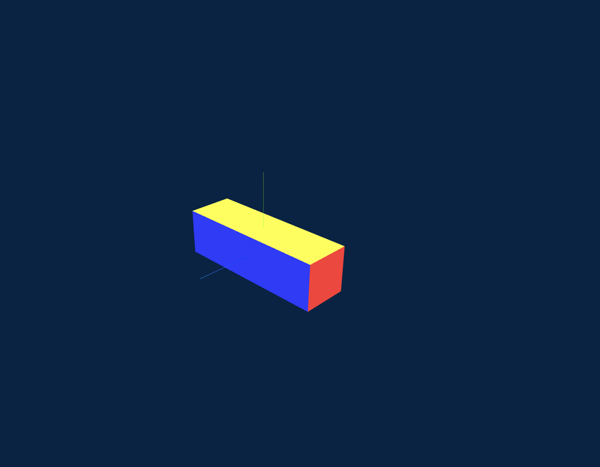

# flexy
A library that bends three.js box geometries along Bezier Curves

# Demo

[Play along with different curves and double bends!](https://ekaratzaferis.github.io/flexy/examples/base/)

# How to install

As an es6 module

```
npm install flexy
```

# How to use it

```js
import * as flexy from 'flexy';
import * as THREE from 'three';

const R = 3;
const startPoint = new Vector3(R, 0, 0);
const controlPoint1 = new Vector3(R, R * 0.55, 0);
const controlPoint2 = new Vector3(R * 0.45, R, 0);
const endPoint = new Vector3(0, R, 0);

// This is a cubic bezier curve. The direction that we're "drawing" the curve, affects the final outcome.
// In this case we're drawing from x = R -> x = 0
// So the point of our geometry with the smallest x coordinate will end up on the x = R position.
// That will make the modified geometry appear as it was also rotated.
const curve = new CubicBezierCurve3(startPoint, controlPoint1, controlPoint2, endPoint);

// A vector that is perpendigular to the plane where most points of the curve lie upon.
// So, if you have a curve that's on the x-y axis, then the orientation could be 0,0,1 or 0,0,-1
// This is usefull to the modifier because it can consistently calculate the tangent lines for each point in the curve, therefore bend every point of the geometry to the correct position.
const orientation = new new THREE.Vector3(0, 0, 1);

flexy.bend({
    THREE,
    axis: 'x' // this is the main dimension that is compressed by the curve
    curve,
    orientation,
    bufferGeometry: mesh.geometry,
});
```

# Behind the scenes

First, we generate a mesh using the THREE.BoxGeometry constructor.


Then we need a curve that our geometry will be placed & streched/bent upon (in our case the X axis).


First we have to normalize each x coordinate of the box, to a point at our curve. For example, the far left x coordinates, will be normalize to the point at the start of the curve.

Next, we calculate the tangent for of these normalized coordinates.


And we procceed by calculating vectors that are orthogonal/perpendicular to the tangent vectors (the purple lines).


Now all we have to do, is to rotated them (counter)clockwise in order to match the (0, y, z) angle that the current x coordintate has.


Here are the resulting normals.


Finally we need to set the length of each normal, equal to the (0, y, z) length.


in order to get something like this:


Here's another screenshot that emphasizes the relationship between the curve and the box after the box.
